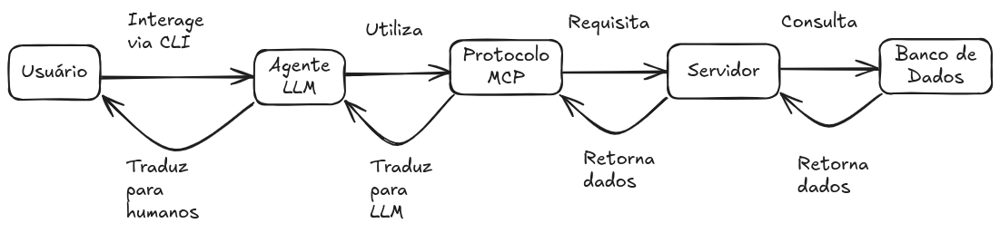
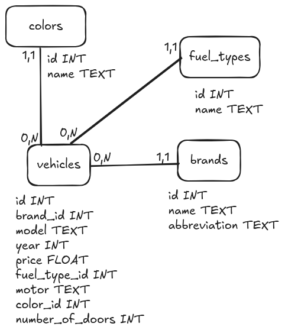

# C2S - Desafio Técnico

Este projeto simula uma API de atendimento integrada a um modelo de linguagem (LLM), que consulta um banco de dados por meio de funções MCP. O desafio consiste em:

- Arquitetar e alimentar um banco de dados com informações fictícias;

- Criar uma API para consulta desses dados;

- Integrar essa API a um LLM via um servidor MCP para responder perguntas de forma automatizada.

## Solução proposta

Para resolver o desafio, desenvolvi uma solução baseada em informações fictícias sobre veículos, com dados como marca, modelo, ano, cor e preço. As informações foram obtidas a partir da BrasilAPI, que oferece acesso à base de dados da FIPE.

A aplicação foi construída com os seguintes componentes:

- Banco de dados PostgreSQL estruturado com SQLAlchemy;

- API desenvolvida com FastAPI, responsável por expor os dados em formato JSON;

- Integração com o OpenAI API, utilizando functions a partir de schemas, para permitir que o LLM acesse os dados e gere respostas inteligentes;

- Interface em linha de comando (CLI) para interação com o modelo, com histórico de perguntas e respostas mantido durante a sessão.

Com isso, o usuário consegue simular, por exemplo, o atendimento de uma concessionária de veículos, fazendo perguntas sobre os dados disponíveis e recebendo respostas baseados em dados reais de banco.

## Tecnologias Utilizadas

- Python 3.10+

- FastAPI

- SQLAlchemy

- PostgreSQL

- OpenAI API

- Docker e Docker Compose

- Poetry (gerenciador de dependências)

## Pré-requisitos

Antes de começar, você vai precisar ter instalado em sua máquina:

- [Python 3.10 ou superior](https://www.python.org/downloads/) para executar o projeto localmente.

- [Poetry](https://python-poetry.org/docs) para gerenciar as dependências do projeto.

- [Docker](https://docs.docker.com/desktop/) para executar as dependências do projeto em contêineres.

## Passos para execução local

1. Clone o repositório:

```
git clone https://github.com/lucas-kaminski/c2s-desafio-tecnico
cd c2s-desafio-tecnico
```

2. Configure as variáveis de ambiente:

```
Copie o arquivo .env.example para .env e preencha os valores necessários.
```

3. Instale as dependências do projeto com Poetry:

```
poetry install
```

4. Inicie o banco de dados (via Docker Compose ou localmente):

```
docker-compose up -d database
```

5. Execute os scripts de criação das tabelas no banco de dados.

```
make create-tables
```

6. Popule o banco com dados fictícios.

```
make populate-tables
```

7. Inicie o servidor (local ou via Docker):

```
make run-server
```

```
docker-compose up -d server
```

8. Execute o cliente CLI para conversar com a LLM:

```
make run-cli
```

9. Comece a interagir com o modelo de linguagem!

## Qualidade do código

### Testes

Os testes foram implementados utilizando o framework pytest. Para executar os testes, utilize o seguinte comando:

```bash
make run-tests
```

### Ordenação, formatação e verificação de código

Os testes de qualidade do código foram implementados utilizando o pre-commit.

Ele é um framework que permite executar scripts de verificação de qualidade do código antes de cada commit. Para configurar o pre-commit, execute:

```bash
make pre-commit-install
```

Se necessário, você pode executar os hooks manualmente com o seguinte comando:

```bash
make pre-commit-run
```

### CI

Os testes de qualidade do código foram implementados utilizando o GitHub Actions. O arquivo de configuração está localizado em `.github/workflows/ci.yml`. Ele executa os testes e verifica a qualidade do código sempre que um push ou pull request é feito na branch `main`.

## Próximas etapas

Tratando-se de um desafio técnico, o foco foi na implementação de uma solução funcional. No entanto, existem várias melhorias que podem ser feitas para aprimorar a aplicação, como por exemplo:

- Melhor administração do número de tokens na conversa com o LLM, evitando erros de limite de tokens.
- Aumentar a cobertura de testes.
- Implementar algumas melhorias de código, como melhor logging e tratamento de erros.
- etc...

## Log de desenvolvimento

Executei o desenvolvimento do projeto em três dias diferentes, somando a dedicação de aproximadamente 10 horas nele, entre planejamento, desenvolvimento, estudos e finalização. Acredito que o tempo foi suficiente para implementar uma solução funcional e atender aos requisitos do desafio, além de mostrar as minhas qualidades como desenvolvedor frente aos requisitos funcionais e não funcionais da vaga. Como não foi definido um limite de tempo, foquei em entregar algo completo em sua essência (código, testes, ferramentas de qualidade, etc....) e que funcionasse corretamente. Obviamente, com uma maior dedicação e até melhor definição do projeto, poderia ter mais funcionalidades e refinamentos, como conversar e adaptar o resultado da LLM conforme necessário, mas, respeitando o meu tempo e o prazo do desafio, optei por realizar a oficialização de tudo em um pacote de horas específicos.

Abaixo segue as minhas considerações sobre cada dia de desenvolvimento:

Dia 1 - 29/04/2025 (+-2h de atuação)

- Recebi o projeto, fiz a leitura e entendimento da demanda.
- Analisei e comparei com as informações da vaga, para alinhar a entrega da demanda com a stack que a empresa requisita.
- Gosto de visualização das minhas entregas, então desenhei o fluxograma 1 para entender mais ou menos como os componentes do sistema se relacionavam.



- Por experiência, gosto de começar por uma das pontas dos componentes e ir componente a componente até a outra ponta, no caso então, tratarei primeiro do banco de dados e sua definição, depois do servidor e suas definições até a a última camada, a de user
- Para alinhar com a vaga, escolhi o PostgreSQL como banco de dados a ser utilizado
- Esbocei o diagrama ER para entender melhor quais tabelas teriam
  - Optei por desnormalizar os dados de color, fuel types e brands focando no critério de pesquisa/filtragem que existem normalmente e sua alta frequência/repetição em relação aos outros dados, como model do vehicle, que pode apresentar leves variações configurando novos carros (um ser 8V e outro 16V porém ter todos as outras características iguais) ou year, price e motor, que estão totalmente relacionados ao modelo e suas variações.
  - Também no desafio não é comentado a proposta de utilização final, por exemplo, se fosse para um atendimento de loja de automóveis, dependendo das requisições do sistema, o modelo ER pode ser diferente, como não definido, presumi os pontos acima.



- Como pretendo organizar todo o projeto via docker e etc... parto para o código do servidor que irá ter todas as configurações referente ao banco de dados, como configuração do contêiner e scripts para criar e alimentar o banco.
  - Inicio o repositório pelo github com o README.md e o .gitignore para python
  - Fiz as configurações iniciais necessárias
  - Fiz a primeira modelagem do sql alchemy e o script para criar o meu banco de dados
  - Fiz o script para apagar meu banco quando necessário
  - Fiz o script para alimentar os dados do banco, nesse caso escolhi duas formas de alimentar esses dados, uma pesquisando via api da BrasilAPI, conectando com o endpoint do FIPE e os outros dados que defini, criei alguns jsons e arrays para alimentar de forma randômica.

Dia 2 - 30/04/2025 (+-4h de atuação)

- Fiz a criação da camada de server, escolhi FastAPI para dar match com a vaga e ter um bom uso com o sqlalchemy. Também a criação do swagger pelo /docs ajuda muito na hora do desenvolvimento. Fiz as rotas de pegar todas as marcas e pegar todos os veículos por marca a partir do brand_id.
- Parti para a camada de MCP, primeiro fiz o entendimento do que seria um e como se integraria, dada as diversas possibilidades, segui o conselho do pdf e busquei fazer o mais core possível, então escolhi a openai para me integrar via llm e comecei a pensar como seria tanto o MCPClient junto com os schemas que representariam as minhas routers.
- Por fim, fiz a parte do cli, criando um script python que interage com o usuário, nessa interação já integrei os schemas que tinha feito e nos primeiros testes, tive de adaptar aqui e ali até conseguir um retorno verdadeiro do sistema, fazendo com que eu perguntasse de uma marca, ele me confirmasse que existe no sistema retornando o seu id e ao perguntar sobre algum carro dessa marca, ele usava via contexto esse id, recebendo todos os carros da marca e me processando o que precisava, por exemplo, algum carro na cor rosa, infelizmente, só tinha na cor salmão, mas serve
- Nesse ponto tinha um sistema completo que conversava com todas as pontas conforme definido inicialmente, tive alguns problemas que não consegui contornar como encadear chamadas de actions para não ter de fazer um double confirm com a IA, porém, já foi um bom avanço, penso que devo definir melhor um escopo de "para o que serve o projeto", como um atendente de concessionária, para adaptar o banco, melhorar os schemas, melhorar a interação e ter um sistema mais "vivo"

Dia 3 - 02/05/2025 (+3h de atuação)

- Iniciei o dia melhorando as rotas e comunicação da LLM, ampliando os parametros que a rota de coletar carro recebia, mudando as models para ter mais opções de dados, alimentando o seed do banco de dados com os dados novos e por fim, rodando tudo para validar um bom funcionamento e resposta da LLM.
- Criei toda a estrutura de CI do projeto, focando em ferramentas como flake8, black e isort junto com alguns testes básicos no pytest e juntando tudo num workflow do github, sofri um pouco com as configs do workflow, principalmente na parte do teste, mas fiz tudo que precisava para rodar e ficar tudo verde. coloquei também o pre-commit, uma ferramenta mto boa nesse sentido de garantir tudo certinho e evitar duplo commit para consertar erro básico de code import, etc...
- Criei a documentação README.md do projeto, irei oficializar em vídeos apresentado tanto a demo quanto o lado técnico para enviar tudo por e-mail e aguardar a avaliação.
